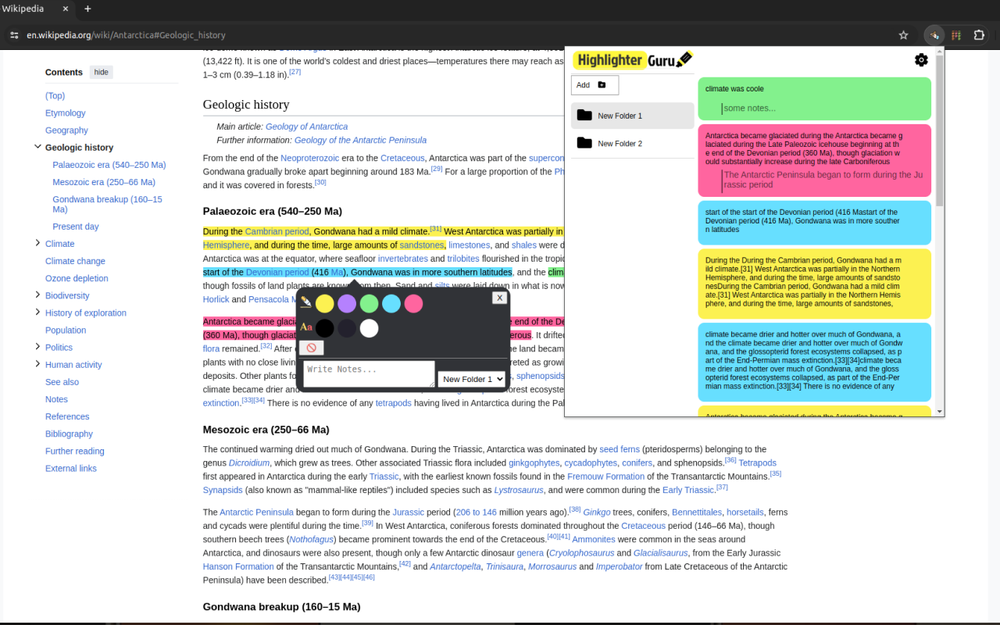

# Highlighter Guru - Text Highlighting Extension for Chrome

introducing "Highlighter Guru" - a free and open source Text Highlighting Extension for Chrome

## Introduction

Welcome to **Highlighter Guru**, a free and open-source text highlighting extension for Chrome. This extension aims to enhance your web browsing experience by providing a simple yet powerful tool for highlighting and organizing text on any web page.

## How to Use

1. **Select the Text:** Highlight the text you want to save or make a note of on any web page.
2. **Press 'h' on Your Keyboard:** Instantly apply your chosen highlight to the selected text.
3. **Right-Click for More Options:** Explore additional options by right-clicking on any highlighted text. Edit, add notes, or organize it into folders – all with a few clicks.

## Key Features

- **Effortless Highlighting:** Select any text on a web page and press 'h' on your keyboard to instantly highlight it.
- **Customization Options:** Tailor your reading experience with a variety of highlighting colors and font options.
- **Folder Organization:** Create folders to categorize and organize your highlights for easy access.
- **Notes and Annotations:** Add context to your highlights by attaching notes, keeping key points and thoughts just a click away.
- **Keyboard Shortcuts:** Customize your experience by setting preferred keyboard shortcuts to integrate Highlighter Guru seamlessly into your workflow.
- **Right-Click Options:** Gain quick access to additional features by right-clicking on any highlighted text. Edit, delete, or review your notes effortlessly.

## Contributing

Feel free to contribute by reporting issues, suggesting new features, or creating pull requests. See [CONTRIBUTING.md](CONTRIBUTING.md) for more details.
